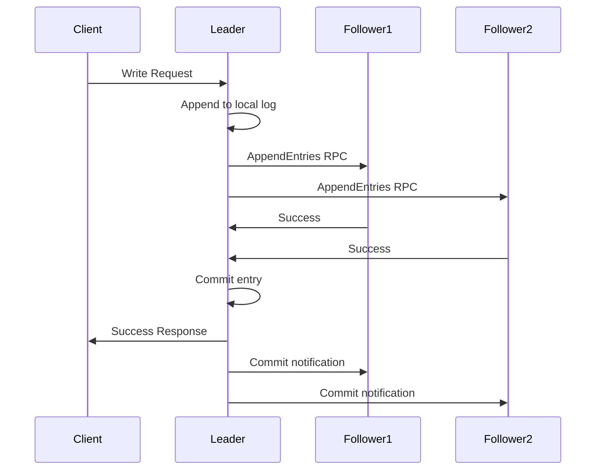

# BlockDB Architecture Guide

## Overview

BlockDB is a distributed, append-only database designed for high-throughput writes, strong consistency, and immutable audit trails. This document provides a comprehensive overview of the system architecture, design decisions, and implementation details.

## System Architecture

### High-Level Architecture

```
┌─────────────────────────────────────────────────────────────┐
│                   Client Applications                       │
│                  (CLI, Web, Services)                      │
└─────────────────────┬───────────────────────────────────────┘
                     │
┌─────────────────────┴───────────────────────────────────────┐
│                    API Gateway                             │
│              (HTTP REST, gRPC, CLI)                       │
└─────────────────────┬───────────────────────────────────────┘
                     │
┌─────────────────────┴───────────────────────────────────────┐
│                 Distributed Layer                          │
│  ┌─────────────────┬─────────────────┬─────────────────┐   │
│  │   Consensus     │   Transactions  │   Cluster Mgmt  │   │
│  │     (Raft)      │   (2PC + ACID)  │  (Discovery)    │   │
│  └─────────────────┴─────────────────┴─────────────────┘   │
└─────────────────────┬───────────────────────────────────────┘
                     │
┌─────────────────────┴───────────────────────────────────────┐
│                  Storage Engine                            │
│  ┌─────────────────┬─────────────────┬─────────────────┐   │
│  │    MemTable     │    SSTable      │   Blockchain    │   │
│  │   (Memory)      │     (Disk)      │  (Integrity)    │   │
│  └─────────────────┴─────────────────┴─────────────────┘   │
└─────────────────────┬───────────────────────────────────────┘
                     │
┌─────────────────────┴───────────────────────────────────────┐
│                Write-Ahead Log (WAL)                       │
│              (Durability & Recovery)                       │
└─────────────────────────────────────────────────────────────┘
```

### Layer Responsibilities

#### 1. API Layer
- **HTTP REST API**: RESTful endpoints for web applications
- **CLI Interface**: Command-line tools for operations and administration
- **gRPC Service**: High-performance RPC for system integration
- **Request Validation**: Input validation and sanitization
- **Response Formatting**: Consistent response formats across interfaces

#### 2. Distributed Layer
- **Consensus Management**: Raft algorithm for distributed coordination
- **Transaction Coordination**: ACID transaction support with 2PC
- **Cluster Management**: Node discovery, health monitoring, membership
- **Load Balancing**: Request distribution across cluster nodes
- **Fault Tolerance**: Automatic failover and recovery

#### 3. Storage Engine
- **MemTable**: In-memory write buffer for recent operations
- **SSTable Management**: Persistent sorted string tables
- **Blockchain Integration**: Cryptographic verification chain
- **Compaction**: Background optimization of storage files
- **Index Management**: Efficient key lookup and range queries

#### 4. Persistence Layer
- **Write-Ahead Logging**: Durability guarantees for all operations
- **Recovery Systems**: Crash recovery and data restoration
- **File Management**: Efficient disk I/O and file organization

## Core Components

### 1. Storage Engine

#### MemTable
The MemTable is an in-memory data structure that serves as the write buffer:

```rust
pub struct MemTable {
    data: BTreeMap<Vec<u8>, Record>,
    size: usize,
    creation_time: SystemTime,
}
```

**Characteristics:**
- **Data Structure**: BTreeMap for ordered key storage
- **Write Path**: All writes go through MemTable first
- **Read Path**: Checked first for latest data
- **Flush Trigger**: Size-based or time-based flushing to SSTable
- **Thread Safety**: Protected by RwLock for concurrent access

#### SSTable (Sorted String Table)
Persistent storage format for immutable data:

```rust
pub struct SSTable {
    file_path: String,
    index: BTreeMap<Vec<u8>, u64>,
    metadata: SSTableMetadata,
}
```

**Design Features:**
- **Immutable**: Once written, never modified
- **Sorted**: Keys stored in lexicographic order
- **Indexed**: Block-based index for efficient seeks
- **Compressed**: Optional compression for space efficiency
- **Versioned**: Support for multiple versions of same key

#### Blockchain Integration
Cryptographic verification layer:

```rust
pub struct Blockchain {
    blocks: Vec<Block>,
    current_batch: Vec<Record>,
    batch_size: usize,
}

pub struct Block {
    id: u64,
    previous_hash: Vec<u8>,
    merkle_root: Vec<u8>,
    records: Vec<Record>,
    timestamp: u64,
    hash: Vec<u8>,
}
```

**Security Features:**
- **Hash Chain**: Each block references previous block hash
- **Merkle Trees**: Efficient verification of large datasets
- **Tamper Detection**: Any modification invalidates chain
- **Batch Processing**: Configurable batch size for performance

### 2. Distributed Consensus

#### Raft Algorithm Implementation
BlockDB implements the Raft consensus algorithm for distributed coordination:

```rust
pub struct RaftNode {
    config: ClusterConfig,
    state: Arc<RwLock<ConsensusState>>,
    log: Arc<RwLock<ReplicatedLog>>,
    // ... other fields
}

pub enum RaftState {
    Follower,
    Candidate,
    Leader,
}
```

**Raft Features:**
- **Leader Election**: Automatic leader selection and failover
- **Log Replication**: Consistent log ordering across all nodes
- **Safety**: Strong consistency guarantees
- **Availability**: Operates with majority of nodes available

#### Consensus Flow



### 3. Transaction Management

#### ACID Transaction Support
BlockDB provides full ACID transaction support:

```rust
pub struct TransactionManager {
    active_transactions: Arc<DashMap<TransactionId, Arc<Mutex<Transaction>>>>,
    lock_manager: Arc<LockManager>,
    transaction_log: Arc<Mutex<TransactionLog>>,
}

pub struct Transaction {
    id: TransactionId,
    state: TransactionState,
    operations: Vec<Operation>,
    read_set: HashSet<Vec<u8>>,
    write_set: HashMap<Vec<u8>, Vec<u8>>,
    start_time: SystemTime,
    timeout: Duration,
}
```

#### Two-Phase Commit (2PC)
For distributed transactions:

```rust
pub struct TwoPhaseCommitCoordinator {
    transaction_manager: Arc<TransactionManager>,
    participants: Vec<String>,
}
```

**2PC Protocol:**
1. **Prepare Phase**: Coordinator asks all participants to prepare
2. **Vote Phase**: Participants vote to commit or abort
3. **Commit Phase**: If all vote commit, coordinator commits globally
4. **Abort Phase**: If any vote abort, coordinator aborts globally

#### Locking Mechanism
Fine-grained locking for isolation:

```rust
pub struct LockManager {
    resource_locks: DashMap<Vec<u8>, Arc<Mutex<ResourceLocks>>>,
    transaction_locks: DashMap<TransactionId, HashSet<Vec<u8>>>,
    deadlock_detector: Arc<Mutex<DeadlockDetector>>,
}

pub enum LockMode {
    Shared,    // Read lock
    Exclusive, // Write lock
}
```

**Lock Features:**
- **Deadlock Detection**: Cycle detection in wait-for graph
- **Timeout Handling**: Automatic lock timeout and cleanup
- **Lock Compatibility**: Shared locks can coexist, exclusive locks cannot
- **Transaction Cleanup**: Automatic lock release on transaction end

### 4. Write-Ahead Logging (WAL)

#### WAL Structure
```rust
pub struct WAL {
    file: BufWriter<File>,
    path: String,
    sync_interval: Duration,
    last_sync: SystemTime,
}

pub struct WALEntry {
    record: Record,
    timestamp: u64,
    checksum: u32,
}
```

**WAL Features:**
- **Durability**: All writes logged before confirmation
- **Recovery**: Replay WAL entries on startup
- **Checksum**: Data integrity verification
- **Sync Policy**: Configurable sync interval for performance tuning

#### Recovery Process
1. **WAL Scan**: Read all WAL entries from last checkpoint
2. **Validation**: Verify checksums and entry consistency
3. **Replay**: Apply entries to MemTable in order
4. **Checkpoint**: Mark successful recovery point

## Data Flow

### Write Path

```
Client Write Request
        │
        ▼
┌─────────────────┐
│  Input Valid.   │
└─────────┬───────┘
          │
          ▼
┌─────────────────┐
│ Duplicate Check │ ◄── Append-Only Enforcement
└─────────┬───────┘
          │
          ▼
┌─────────────────┐
│   WAL Append    │ ◄── Durability
└─────────┬───────┘
          │
          ▼
┌─────────────────┐
│ MemTable Insert │
└─────────┬───────┘
          │
          ▼
┌─────────────────┐
│ Blockchain Add  │ ◄── Integrity Verification
└─────────┬───────┘
          │
          ▼
┌─────────────────┐
│ Success Return  │
└─────────────────┘
          │
          ▼ (Background)
┌─────────────────┐
│ MemTable Flush  │ ◄── When size limit reached
└─────────┬───────┘
          │
          ▼
┌─────────────────┐
│ SSTable Create  │
└─────────────────┘
```

### Read Path

```
Client Read Request
        │
        ▼
┌─────────────────┐
│  Input Valid.   │
└─────────┬───────┘
          │
          ▼
┌─────────────────┐
│ Check MemTable  │ ◄── Latest data first
└─────────┬───────┘
          │ Not Found
          ▼
┌─────────────────┐
│ Check SSTables  │ ◄── Newest to oldest order
└─────────┬───────┘
          │
          ▼
┌─────────────────┐
│ Return Result   │
└─────────────────┘
```

### Distributed Write Path

```
Client → Leader → Consensus → Storage
                     │
                     ▼
              ┌─────────────┐
              │ Log Entry   │
              └──────┬──────┘
                     │
                     ▼
              ┌─────────────┐
              │ Replicate   │ ◄── To all followers
              └──────┬──────┘
                     │
                     ▼
              ┌─────────────┐
              │ Majority    │ ◄── Wait for majority ACK
              │ Confirm     │
              └──────┬──────┘
                     │
                     ▼
              ┌─────────────┐
              │ Apply to    │
              │ Storage     │
              └─────────────┘
```

## Design Decisions

### 1. Append-Only Architecture

**Decision**: No updates or deletes allowed, only inserts.

**Rationale**:
- **Simplicity**: Eliminates complex update logic
- **Performance**: Optimized for write-heavy workloads
- **Audit Trail**: Complete history preservation
- **Consistency**: Reduces conflict resolution complexity

**Trade-offs**:
- **Storage Growth**: Monotonic storage increase
- **Compaction Complexity**: Background cleanup required
- **Query Patterns**: Limited to point lookups and scans

### 2. LSM-Tree Storage

**Decision**: Use Log-Structured Merge Tree architecture.

**Rationale**:
- **Write Performance**: Sequential writes are faster than random
- **Append-Only Friendly**: Natural fit for immutable data
- **Compaction Control**: Background optimization
- **Memory Efficiency**: Bounded memory usage

**Implementation Details**:
- **MemTable**: BTreeMap for ordered in-memory storage
- **SSTable**: Immutable disk files with block-based indexing
- **Compaction**: Level-based or size-tiered strategies

### 3. Raft Consensus

**Decision**: Use Raft algorithm for distributed consensus.

**Rationale**:
- **Understandability**: Easier to understand than Paxos
- **Proven**: Well-tested in production systems
- **Strong Consistency**: CP guarantee from CAP theorem
- **Leader-Based**: Simplifies client interaction

**Configuration**:
- **Election Timeout**: 300ms (configurable)
- **Heartbeat Interval**: 150ms (configurable)
- **Majority Quorum**: Required for all decisions

### 4. Blockchain Integration

**Decision**: Integrate blockchain for data integrity.

**Rationale**:
- **Tamper Detection**: Cryptographic verification
- **Audit Trail**: Immutable history
- **Trust**: Verifiable data integrity
- **Compliance**: Regulatory requirements

**Implementation**:
- **Hash Algorithm**: SHA-256
- **Block Structure**: Merkle trees for efficiency
- **Batch Size**: Configurable for performance tuning

### 5. ACID Transactions

**Decision**: Provide full ACID transaction support.

**Rationale**:
- **Data Integrity**: Prevent partial updates
- **Application Support**: Enable complex business logic
- **Consistency**: Maintain database invariants
- **Isolation**: Prevent concurrent interference

**Implementation**:
- **2PC**: For distributed transactions
- **Fine-Grained Locking**: Per-key locking
- **Deadlock Detection**: Cycle detection algorithm
- **Timeout Handling**: Prevent resource leaks

## Performance Characteristics

### Throughput

**Single Node**:
- **Write Throughput**: 190+ operations/second
- **Read Throughput**: 1000+ operations/second (cached)
- **Mixed Workload**: 150+ operations/second

**Distributed Cluster** (3 nodes):
- **Write Throughput**: 85% of single node (consensus overhead)
- **Read Throughput**: 3x single node (distributed reads)
- **Fault Tolerance**: Continues with 2/3 nodes available

### Latency

**Operation Latencies**:
- **MemTable Read**: < 1ms
- **SSTable Read**: 1-5ms (depending on index cache)
- **Write Operation**: 5-10ms (WAL + MemTable)
- **Consensus Write**: 10-20ms (distributed coordination)

**Factors Affecting Latency**:
- **Disk I/O**: SSD vs HDD performance
- **Network Latency**: Cluster communication overhead
- **MemTable Size**: Affects flush frequency
- **Compaction**: Background I/O impact

### Memory Usage

**Base Memory**: ~100MB for database engine
**MemTable**: Configurable (default 64MB)
**Index Cache**: 10-20% of SSTable size
**Transaction State**: ~1KB per active transaction
**Consensus State**: ~10MB for cluster metadata

### Storage Overhead

**WAL Overhead**: ~20% of data size (temporary)
**Blockchain Overhead**: ~30% of data size (permanent)
**SSTable Overhead**: ~10% of data size (indexes)
**Total Overhead**: ~40-50% of raw data size

## Scalability

### Horizontal Scaling

**Read Scaling**:
- Reads can be served from any node
- Linear scaling with cluster size
- Local read optimization

**Write Scaling**:
- All writes go through consensus
- Limited by consensus latency
- Batch operations improve throughput

### Vertical Scaling

**Memory Scaling**:
- Larger MemTables reduce flush frequency
- More memory for index caching
- Transaction capacity increases

**Storage Scaling**:
- SSD improves I/O performance
- Larger storage allows more data
- Better compaction strategies

### Network Considerations

**Bandwidth Requirements**:
- **Consensus Traffic**: ~10KB per write operation
- **Replication Traffic**: Full data replication
- **Heartbeats**: ~1KB per heartbeat interval

**Latency Requirements**:
- **Intra-cluster**: < 10ms for optimal performance
- **Client-cluster**: < 100ms for good user experience

## Security Model

### Current Security Features

1. **Data Integrity**: Blockchain verification
2. **Append-Only**: Immutable audit trail
3. **Consensus**: Byzantine fault tolerance (planned)

### Planned Security Features

1. **Authentication**: Token-based authentication
2. **Authorization**: Role-based access control
3. **Encryption**: Data encryption at rest and in transit
4. **Audit Logging**: Comprehensive access logs

### Security Considerations

1. **Network Security**: Secure cluster communication
2. **Access Control**: Restrict database directory access
3. **Key Management**: Secure handling of encryption keys
4. **Compliance**: GDPR, SOX, HIPAA considerations

## Monitoring and Observability

### Key Metrics

**Performance Metrics**:
- Read/write throughput and latency
- Cache hit rates
- Compaction frequency
- WAL size and sync frequency

**Storage Metrics**:
- MemTable utilization
- SSTable count and size
- Disk usage and I/O patterns
- Blockchain verification time

**Cluster Metrics**:
- Leader election frequency
- Node health and connectivity
- Consensus latency
- Transaction success/failure rates

### Health Checks

**Database Health**:
- Basic read/write operations
- Blockchain integrity verification
- Storage space availability

**Cluster Health**:
- Node connectivity
- Leader availability
- Consensus performance

### Alerting

**Critical Alerts**:
- Node failures
- Blockchain integrity failures
- Storage space exhaustion
- High error rates

**Warning Alerts**:
- High latency
- Memory pressure
- Compaction delays
- Network issues

## Future Enhancements

### Planned Features

1. **Range Queries**: Efficient range scans
2. **Secondary Indexes**: Support for additional query patterns
3. **Stream Processing**: Real-time data streaming
4. **Multi-DC Replication**: Geographic distribution
5. **Schema Evolution**: Versioned data schemas

### Performance Optimizations

1. **Bloom Filters**: Reduce SSTable reads
2. **Compression**: Reduce storage overhead
3. **Parallel Compaction**: Improve background performance
4. **Smart Caching**: ML-based cache optimization

### Operational Improvements

1. **Automated Backup**: Scheduled backups and restoration
2. **Hot Reconfiguration**: Runtime configuration changes
3. **Advanced Monitoring**: Machine learning for anomaly detection
4. **Multi-Tenant Support**: Isolated database instances

This architecture provides a solid foundation for a high-performance, distributed, append-only database with strong consistency guarantees and comprehensive audit capabilities.